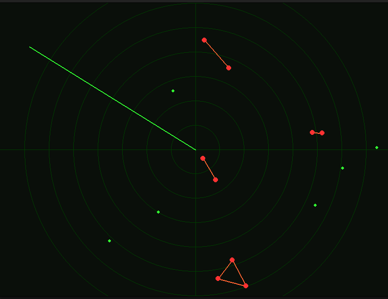

# Radar de Proximidade

**Projeto de Algoritmos (PA) - UnB 2026.1**  
**Módulo:** Dividir e Conquistar  
**Repositório do Grupo 26**

**Integrantes:**
* `23/1011284` - Eduardo Silva Waski
* `23/1027121` - José Victor Gabriel Menezes da Costa

---

## 📌 Sobre o Projeto

Este projeto é uma simulação de controle de tráfego aéreo/radar utilizando a biblioteca visual **Pygame**. O principal foco da aplicação é demonstrar a aplicação prática de algoritmos clássicos do paradigma **Dividir e Conquistar** para processar posições no plano 2D e detectar riscos de colisão entre aeronaves em tempo real, de forma eficiente.



## ⚙️ Algoritmos Implementados

O projeto soluciona a detecção de ameaças utilizando conceitos pesados do paradigma de divisão:

* **Mediana das Medianas (Median of Medians - MOM):** 
  Implementado no arquivo `algorithms/median_selection.py`. É utilizado para encontrar de forma determinística (em tempo linear $O(N)$) o k-ésimo menor elemento de um array não ordenado. Neste projeto, ele é o motor principal que encontra o pivô exato para o particionamento equilibrado das aeronaves no eixo X em cada passo da recursão.

* **Par de Pontos Mais Próximos (Closest Pairs of Points) - Adaptado:**
  Implementado no arquivo `algorithms/closest_pair.py`. Ao invés de apenas retornar o ponto mais próximo no clássico $O(N \log N)$, o algoritmo foi turbinado. Ele divide o espaço visual usando a **Mediana das Medianas**, analisa a faixa de fronteira (Strip) e retorna **todas as aeronaves** cuja distância mútua é inferior a um limiar crítico de segurança (`DANGER_DISTANCE`).

## 🚀 Como Executar

**Pré-requisitos:**
Certifique-se de possuir o Python instalado na sua máquina e o pacote `pygame`.

1. Instale as dependências (caso não possua o pygame):
   ```bash
   pip install -r requirements.txt
   ```
2. Execute o arquivo principal para iniciar o radar:
   ```bash
   python main.py
   ```

## 🎮 A Interface Visual

Na tela de simulação do Radar, as entidades (aviões/navios) aparecerão como pontos que navegam pelo espaço delimitado. Em tempo real, o algoritmo mapeia o espaço: sempre que duas aeronaves violarem o espaço mínimo de segurança entre si, um alerta visual ocorrerá desenhando "cabos" vermelho/laranja ligando os nós de risco, servindo como um aviso de colisão.